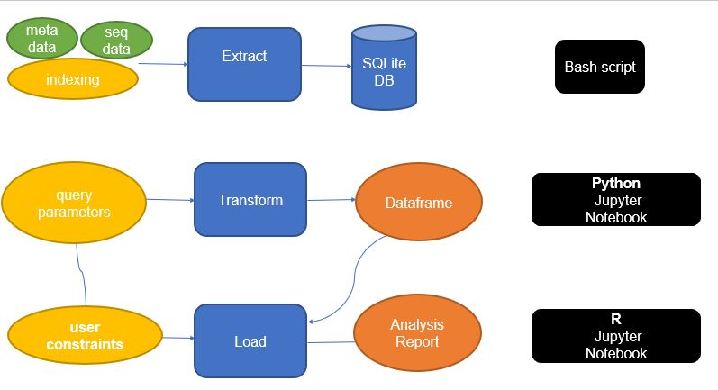

# precisionFDA_Covid19_repo

Data mining of clinical associations from bioinformatics analysis of immunological data 

By Dr. Mahmoud Shobair and Gerald Parker

***

The tool which we have created is designed to handle these functions:

- Takes data from supplied CSV and converts into a SQLite DB
- Takes the SQLite DB and allows the user to clean ahd select relevant data for hypothesis testing to use into a CSV or SQLite DB.
- Allows the user to load the transformed data to perform exploratory data analysis (EDA). An example use case of data visualization is presented in an R-notebook comparing protein sequence data between subjects grouped by disease_stage clinical variable.

This document will be broken down into each portion of the traditional ETL model in seperate sections.

***
Here is an overview of the workflow.



## Setting up dependencies and virtual environment
App development and testing was done primarily in Ubuntu 20.04/18.04.

### Install ubuntu dependencies:
```sh
sudo apt install -y  curl sqlite3 pipenv jupyter-client libcurl4-gnutls-dev libgsl-dev libgsl23 libsodium23 libssl-dev libxml2-dev nodejs npm python3-nacl python3-pymacaroons r-base-core libcurl4-openssl-dev 
```
### Activate virtual environment using pipenv
```sh
pipenv install
```
### Install R packages
```R
install.packages(c("IRkernel", "data.table", "RSQLite", "sqldf", "BiocManager"))
library(IRkernel)
IRkernel::install_spec()
library(BiocManager)
BiocManager::install("universalmotif")
```
### Download, extract the zipped repo source to activate the virtual environment 
```sh
curl -L -O https://github.com/mshobair/precisionFDA_Covid19_repo/archive/main.zip
unzip main.zip -d .
cd precisionFDA_Covid19_repo
pipenv install
```

## Creating and indexing SQLite database
```sh
cd extract_to_sql/
# change input tables to their local paths
sh ./create_sqlitedb.sh ./seqtable_test.tsv ./metadata_test.tsv
```

### Activating python virtual environment to launch juypyter notebook
```sh
pipenv install

### Extract

The extraction and staging of the data is done using a shell script that takes the CSV/TSV formatted data and exports it into a SQLite staging database.

Outlined below is the shell script and it's functionality.

**Generates a new SQLite DB file with the name "test.db" within the directory which the script is run.**

sqlite3 ./test.db << EOF

*This can be edited to place the database wherever you have the storage.*

**This stage takes the input files, creates tables within the DB, and then exports the data into those tables from the different inputs.**

.mode tabs ;
.import "./seqtable_test.tsv" seqtable
.import "./metadata_test.tsv" metadata_table

*In this example the input files were TSV - but many other flat file formats can be used as a data source.*

**This stage declares the columns and indices for the table labeled 'seqtable'.**
column
CREATE INDEX seq_ind ON seqtable(sample_processing_id);
CREATE INDEX jun_aa_len ON seqtable(junction_aa_length);

*The names in this example are used to reflect the types of data we will be working with.

**This stage declares the columes and indices for the table labeled 'metadata_table'**
CREATE INDEX meta_ind ON metadata_table(sample_processing_id,subject_id,
sex, disease_diagnosis, disease_stage, intervention);

*As before - the names in this example are used to reflect the types of data we will be working with

***This script is designed to be easily readable and editable to better customize your staging database's format.

***

### Transform

For our methodology around Transforming, filtering, and converting the data we used a Jupyter Notebook.  This Notebook is meant to be run in full after entering the parameters.  An easy way to do this is by clicking the "Fast Forward" button at the top of the page.

**Data Filtering and Conversion Notebook**

The primary function of this notebook is to filter and clean the data generated in the "Extract" step.

This Notebook is meant to be usable by someone with little to no coding knowledge - but still needs to do specialized data processing.

After loading the needed libraries the user will add the path to their SQLite DB so the Notebook can create a connection to it.

Once the SQLite connection instance has been generated the user has the option for generating custom SQL Queries.

***A user well versed in writing SQL queries can create many different types of Queries and Constraints that can generate highly specific datasets to suit their needs..

Users have the option of exporting the newly cleaned data into either a CSV or another SQLite DB.  Simply comment out the type of file you do NOT want to get and state a path for it to be written to.

***If you so choose, the queries can be piped to the dataoutput of the notebook and used in multiple ways.

Once all query parameters are in place you can simply run the entire notebook by using the "Fast Forward" button at the time.  This restarts the python kernel and runs the entire notebook.

***Pleae make certain that you have ample storage and memory resources if the inbound DB is large and the queries complex.


